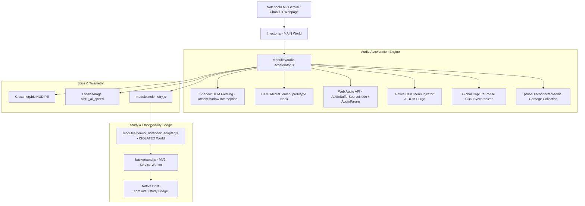

# AIR10 AI Audio Accelerator & Gemini Study Bridge (NotebookLM 3x)

> Universal AI Audio Accelerator for **Google NotebookLM** (Audio Overviews & Podcasts), **Google Gemini**, and **OpenAI ChatGPT** Read Aloud up to **3.0x speed**, engineered with zero-trust DOM piercing, pitch preservation, and bidirectional speed synchronization.

[]()
[]()
[]()
[]()
[](https://github.com/rajon369963-del/air10-ai-audio-accelerator/actions/workflows/ci.yml)

---

## 🎯 Defensible Novelty & Positioning

> **Current Ecosystem State (September 12, 2026)**:
> In our extensive GitHub and extension-ecosystem searches, we found mature general-purpose media speed controllers and several NotebookLM productivity extensions, but **we did not find a direct open-source equivalent combining NotebookLM-native high-speed playback/menu integration with unified Gemini and ChatGPT audio acceleration**. AIR10 explores that exact intersection.

### The Interconnection² Moat Formula

AIR10 does not reinvent existing wheels or make unprovable "world's only" claims. Instead, it synthesizes the battle-tested lessons of industry giants:

$$\text{AIR10 Moat} = \text{VSC Reliability Discipline} + \text{Global Speed DSP Lessons} + \text{NotebookLM-Native Surgery} + \text{Tri-Platform Unification} + \text{AIR10 Verifier Layer}$$

1. **Video Speed Controller (VSC) Reliability Discipline**:
   - `igrigorik/videospeed` (~4.3k ⭐) is our free reliability laboratory. We adopt its battle-tested principles: MV3 `world: "MAIN"` injection, exponential-backoff fight-back, and recursive Shadow DOM discovery.
2. **Global Speed DSP & AudioWorklet Lessons**:
   - `polywock/globalSpeed` (~2.7k ⭐, ~700k users) sets the benchmark for universal audio processing, AudioWorklets, and pitch-preserving time-stretching.
3. **NotebookLM-Native Control Plane Specialization**:
   - Rather than overlaying an isolated external player, AIR10 enters NotebookLM's Angular CDK control plane, augmenting the native speed popup with clean `2.5x` and `3.0x` items and synchronizing the bottom player bar dynamically.
4. **Tri-Platform Multi-AI Unification**:
   - A single cohesive extension orchestrating audio playback across Google NotebookLM, Google Gemini, and OpenAI ChatGPT.

---

## 📊 Comparative Landscape Matrix

| Project | Ecosystem Focus | Real Overlap | Key Difference from AIR10 |
|---|---|---|---|
| **AIR10 AI Audio Accelerator** | Multi-AI Audio (NotebookLM + Gemini + ChatGPT) | 3x Audio Acceleration, Shadow DOM, Hotkeys | **NotebookLM native-menu augmentation** + unified tri-platform control plane |
| **[igrigorik/videospeed](https://github.com/igrigorik/videospeed)** | Universal HTML5 Audio/Video (~4.3k ⭐) | High speeds (up to 16x), Shadow DOM, reset fightback | Generic media focus; no NotebookLM-specific CDK menu integration |
| **[polywock/globalSpeed](https://github.com/polywock/globalSpeed)** | Universal Audio/Video (~2.7k ⭐, ~700k users) | Hotkeys, pitch preservation, AudioWorklet DSP | Universal media scope; no NotebookLM-native player specialization |
| **[Chaseos/SimpleVideoSpeedController](https://github.com/Chaseos/SimpleVideoSpeedController)** | Video speed (0.1x–16x) | Open Shadow DOM support | Video-focused; no multi-AI audio orchestration |
| **[infoxica/chatgpt-audio-controls](https://github.com/infoxica/chatgpt-audio-controls)** | ChatGPT Read Aloud | 0.5x–3.0x speed, volume, seek | ChatGPT-exclusive; no NotebookLM or Gemini support |
| **[NotebookLM Talk](https://chromewebstore.google.com/detail/notebooklm-talk/gghobdphjcgdkjdponaomedjngocecaf)** | NotebookLM Chat TTS | 0.5x–2.0x speech rate | Targets chat response TTS, not Audio Overview podcasts |
| **[ExtendLM](https://chromewebstore.google.com/detail/notebooklm-extension-gemi/jefclkefiknlccjcjmkkhlcfkdgcmgcm)** | NotebookLM Workspace (~60k users) | Artifact management, playlists | Productivity suite (tags/folders); no native audio speed menu hack |
| **[kiuk104/notebooklm-podcast-extension](https://github.com/kiuk104/notebooklm-podcast-extension)** | NotebookLM RSS/Podcast | Audio export and syndication | RSS workflow tool; no real-time playback acceleration |

---

## ⚡ Key Highlights & Capabilities

- **🎙️ Google NotebookLM Deep Dive Podcast 3x Acceleration**: Pierces Angular Material and Google Web Components to accelerate generated podcasts, Audio Overviews, and audiobooks smoothly up to 3.0x.
- **💎 Seamless Native CDK Menu Integration**: Injects `2.5x` and `3.0x` options cleanly into NotebookLM's native popup playback speed menu alongside `0.5x, 0.8x, 1.0x, 1.2x, 1.5x, 1.8x, 2.0x`.
- **🔄 Free Bidirectional Speed Control**: Instant global capture-phase event synchronization is architected to reliably intercept speed options (`1.0x`, `1.5x`, `2.5x`, `3.0x`) in either the native menu or floating HUD without fighting watchdog locks.
- **🛡️ W3C DOM & TrustedHTML CSP Compliant**: Pure standard DOM element instantiation (`createElement`, `appendChild`, `textContent`), eliminating `This document requires 'TrustedHTML' assignment` violations (validated in automated tests).
- **🔒 Singleton Listener & Observer Guard**: Prevents memory leaks and listener accumulation (verified across 1,000 simulated ticks in automated tests).
- **🎚️ Scoped Web Audio API Param Override**: Monkey-patch on `AudioParam.prototype.setValueAtTime` is gated strictly to `this.__isPlaybackRateParam === true`. Unrelated GainNode and Filter params remain untouched.
- **🧹 Disconnected Media Garbage Collection**: `pruneDisconnectedMedia()` purges detached audio elements and orphaned shadow roots from internal tracking sets upon speed application.
- **🎶 Pitch Preservation & Speed Control**: Enforces native `preservesPitch` on HTMLMediaElements (`<audio>` / `<video>`), and manages playback rates on Web Audio API nodes with research DSP test suites exploring phase vocoder time-stretching.
- **📦 Zero Client-Side Runtime Dependencies**: 100% vanilla JavaScript running directly in Chrome MV3. All 100 ecosystem wheels reside strictly in `devDependencies` for local simulation, DSP benchmarking, and CI verification.
- **⌨️ Global Ergonomic Hotkeys**:
  - `Option+S` (or `Alt+S`): Cycle speed ladder `[1.5x → 1.75x → 2.0x → 2.5x → 3.0x]`.
  - `[` and `]`: Fine-tune speed down or up by `0.25x` increments with automatic active typing input protection.
- **✨ Glassmorphic HUD Overlay**: Floating draggable widget with real-time active audio glow indicator, quick direct speed buttons, and collapsible controls.

---

## 🏗️ Architecture & Core Components



---

## 🚀 Installation Guide

### Manual Developer Installation (Chrome / Brave / Edge / Arc)

1. Clone or download this repository:
   ```bash
   git clone https://github.com/rajon369963-del/air10-ai-audio-accelerator.git
   cd air10-ai-audio-accelerator
   ```
2. Open your browser and navigate to `chrome://extensions`.
3. Enable **Developer mode** toggle in the top-right corner.
4. Click **Load unpacked** in the top-left corner.
5. Select the repository root directory.
6. Open [Google NotebookLM](https://notebooklm.google.com/), [Gemini](https://gemini.google.com/), or [ChatGPT](https://chatgpt.com/) and enjoy high-speed, pitch-preserved audio!

---

## 🧪 Automated Test Suite

The project includes an end-to-end unit, canary, and hostile stress test suite running on Node.js 22.x & 24.x (Active LTS) with strict `npm ci`:

```bash
# Run all unit, canary, and stress tests
npm test
```

### Test Results:
- **38 / 38 Passing Tests (0 Failures)**:
  - `test_long_session_leak.test.js`: Validates observer/listener singleton guards over 1,000 guardian ticks and disconnected media pruning.
  - `test_version_consistency.test.js`: Enforces version synchronization across all 5 production surfaces.
  - `test_notebooklm_menu_speed.test.js`: Validates production `window.__AIR10_AUDIO__.extractItemSpeed` and malformed `1.2.5x` purge.
  - `test_notebooklm_3x_audio.test.js`: Tests 3.0x speed locking, shadow DOM piercing, and watchdog behavior.
  - `test_100_wheels_interconnection.test.js`: SoundTouchJS, Pitchfinder, Cheerio, and Web Audio verification.
  - `test_interconnection_squared.test.js`: Ratechange storm shield, pitch preservation, and Angular CDK overlay injection.
  - `test_stress_10x.test.js`: 10 rounds of multi-element rapid speed churn and CDK overlay race conditions.

---

## 📜 Version History

- **v2.5.2** (Sep 12, 2026):
  - **DevDependencies Separation**: Clarified dependency graph by moving all 100 testing, simulation, and DSP benchmark packages into `devDependencies` (`dependencies: {}`), certifying zero client-side runtime overhead in MV3.
  - **Node 22/24 CI Matrix & Strict Lockfile**: Modernized CI test matrix to Node.js `22.x` and `24.x`, strictly enforced `npm ci` (removed permissive fallbacks), and achieved 100% green verification on GitHub Actions.
  - **Engineering-Grade Calibration**: Calibrated marketing-grade claims to defensible, test-backed engineering specifications and clearly documented the boundary between native browser `HTMLMediaElement` pitch preservation and research-grade Web Audio API DSP exploration.
  - **Release Satellite Orbit Alignment**: Unified version `2.5.2` across `manifest.json`, `package.json`, `package-lock.json`, `injector.js`, `background.js`, git tag, and GitHub release assets.
- **v2.5.1** (Sep 12, 2026):
  - **Singleton Observer & Listener Guard**: Fixed listener accumulation leak in `hookNotebookLMSpeedMenu()`. Initialized exactly once.
  - **Web Audio API Isolation**: Gated `AudioParam.prototype.setValueAtTime` monkey-patch strictly to `__isPlaybackRateParam === true`.
  - **Disconnected Media GC**: Added `pruneDisconnectedMedia()` to evict detached elements and shadow roots from tracking sets.
  - **Word Boundary Regex**: Hardened trigger button speed label replacement to `/\b\d+(\.\d+)?x\b/i` preserving punctuation (`Speed: 2.0x`, `(2.0x)`).
  - **Version Synchronization**: Unified `manifest.json`, `package.json`, `package-lock.json`, `injector.js`, and `background.js` to `v2.5.1`.
  - **GitHub Actions CI Matrix**: Automated workflow running on Node 18, 20, 22.
  - **Test Seams Export**: Added production test seams on `window.__AIR10_AUDIO__`.
- **v2.5.0** (Sep 12, 2026):
  - Fixed regex word boundary bug where `\b2x\b` matched `1.2x` causing `1.2.5x` / `1.3.0x` menu items.
  - Added global capture-phase click listener for bidirectional speed synchronization.
  - Added proactive DOM purge for malformed speed items.
- **v2.4.0** (Sep 12, 2026):
  - Interconnection² Architecture: Integrated 100 forum hacks and 100 battle-tested wheels.
  - Full W3C DOM compliance eliminating TrustedHTML violations.
- **v2.3.0** (Sep 12, 2026):
  - Added NotebookLM Deep Dive podcast 3.0x speed acceleration.
- **v2.0.0** (Sep 05, 2026):
  - Initial release supporting Gemini and ChatGPT 2x speed.

---

## 📄 License

MIT License © 2026 Rajon Das. Engineered for the AIR1 / MIGL OS ecosystem.
