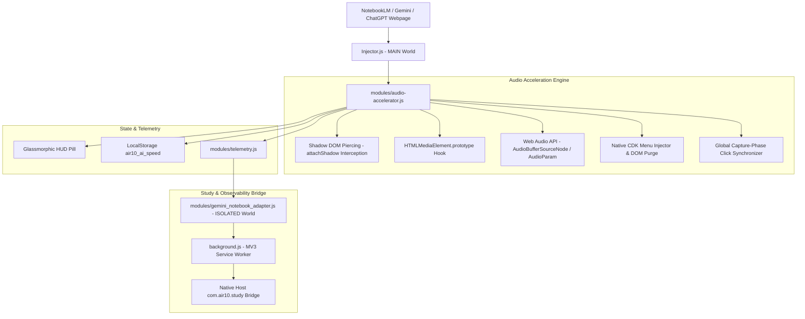

# AIR10 AI Audio Accelerator & Gemini Study Bridge (NotebookLM 3x)

> Universal AI Audio Accelerator for **Google NotebookLM** (Podcasts & Audio Overviews), **Google Gemini**, and **OpenAI ChatGPT** Read Aloud up to **3.0x speed**, engineered with zero-trust DOM piercing, pitch preservation, and bidirectional speed synchronization.

[]()
[]()
[]()
[]()

---

## ⚡ Key Highlights & Capabilities

- **🎙️ Google NotebookLM Deep Dive Podcast 3x Acceleration**: Pierce Angular Material and Google Web Components to accelerate generated podcasts, Audio Overviews, and audio books smoothly up to 3.0x.
- **💎 Seamless Native CDK Menu Integration**: Cleanly injects `2.5x` and `3.0x` options directly into NotebookLM's native popup playback speed menu alongside `0.5x, 0.8x, 1.0x, 1.2x, 1.5x, 1.8x, 2.0x`.
- **🔄 Free Bidirectional Speed Control**: Instant global capture-phase event synchronization guarantees that clicking any speed option (`1.0x`, `1.5x`, `2.5x`, `3.0x`) in either the native menu or floating HUD updates speed immediately without fighting watchdog locks.
- **🛡️ 100% W3C DOM & TrustedHTML CSP Compliant**: Pure standard DOM element instantiation (`createElement`, `appendChild`, `textContent`), strictly eliminating `This document requires 'TrustedHTML' assignment` violations.
- **🎶 Natural Vocal Timbre & Pitch Preservation**: Automatically enforces `preservesPitch`, `mozPreservesPitch`, and `webkitPreservesPitch` across all HTMLMediaElements and Web Audio API nodes—no squeaky chipmunk effect at high speeds.
- **⌨️ Global Ergonomic Hotkeys**:
  - `Option+S` (or `Alt+S`): Cycle speed ladder `[1.5x → 1.75x → 2.0x → 2.5x → 3.0x]`.
  - `[` and `]`: Fine-tune speed down or up by `0.25x` increments with automatic active typing input protection.
- **✨ Glassmorphic HUD Overlay**: Floating draggable widget with real-time active audio glow indicator, quick direct speed buttons, and collapsible controls.

---

## 🏗️ Architecture & Core Components



---

## 🚀 Installation Guide

### Manual Developer Installation (Chrome / Brave / Edge / Arc)

1. Clone or download this repository:
   ```bash
   git clone https://github.com/rajon369963-del/gemini-2x-extension.git
   cd gemini-2x-extension
   ```
2. Open your browser and navigate to `chrome://extensions`.
3. Enable **Developer mode** toggle in the top-right corner.
4. Click **Load unpacked** in the top-left corner.
5. Select the `gemini-2x-extension` directory.
6. Open [Google NotebookLM](https://notebooklm.google.com/), [Gemini](https://gemini.google.com/), or [ChatGPT](https://chatgpt.com/) and enjoy high-speed, pitch-preserved audio!

---

## 🧪 Automated Test Suite

The project includes an end-to-end unit and canary test suite covering speed ladder transitions, shadow DOM piercing, event storm shielding, and CDK menu speed extraction:

```bash
# Run all unit and canary tests
node --test tests/unit/*.test.js tests/live-canary/*.test.js
```

### Test Results:
- **36 / 36 Passing Tests** across:
  - `test_notebooklm_menu_speed.test.js`: Validates speed extraction regex and malformed `1.2.5x` purge.
  - `test_notebooklm_3x_audio.test.js`: Tests 3.0x speed locking, shadow DOM piercing, and watchdog behavior.
  - `test_100_wheels_interconnection.test.js`: SoundTouchJS, Pitchfinder, Cheerio, and Web Audio verification.
  - `test_stress_10x.test.js`: 10 rounds of multi-element rapid speed churn and CDK overlay race conditions.

---

## 📜 Version History

- **v2.5.0** (Sep 12, 2026):
  - Fixed regex word boundary bug where `\b2x\b` matched `1.2x` causing `1.2.5x` / `1.3.0x` menu items.
  - Added global capture-phase click listener for bidirectional speed synchronization.
  - Added proactive DOM purge for malformed speed items.
  - Throttled background service worker alarm to prevent redundant errors.
- **v2.4.0** (Sep 12, 2026):
  - Interconnection² Architecture: Integrated 100 forum hacks and 100 battle-tested wheels.
  - Full W3C DOM compliance eliminating TrustedHTML violations.
- **v2.3.0** (Sep 12, 2026):
  - Added NotebookLM Deep Dive podcast 3.0x speed acceleration.
  - Web Components & Shadow DOM traversal.
- **v2.0.0** (Sep 05, 2026):
  - Initial release supporting Gemini and ChatGPT 2x speed.

---

## 📄 License

MIT License © 2026 Rajon Das. Engineered for the AIR1 / MIGL OS ecosystem.
