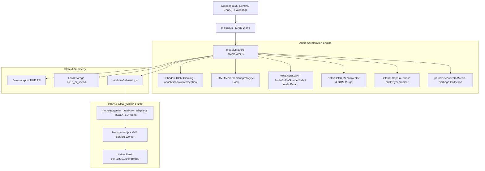

# AIR10 AI Audio Accelerator & Gemini Study Bridge (NotebookLM 3x)

> Universal AI Audio Accelerator for **Google NotebookLM** (Audio Overviews & Podcasts), **Google Gemini**, and **OpenAI ChatGPT** Read Aloud up to **3.0x speed**, engineered with zero-trust DOM piercing, pitch preservation, and bidirectional speed synchronization.

[]()
[]()
[]()
[]()
[]()
[](https://github.com/rajon369963-del/air10-ai-audio-accelerator/actions/workflows/ci.yml)

---

## 🎯 Defensible Novelty & Positioning

> **Current Ecosystem State (September 12, 2026)**:
> In our extensive GitHub and extension-ecosystem searches, we found mature general-purpose media speed controllers and several NotebookLM productivity extensions, but **we did not find a direct open-source equivalent combining NotebookLM-native high-speed playback/menu integration with unified Gemini and ChatGPT audio acceleration**. AIR10 explores that exact intersection.

### The Interconnection² Moat Formula

AIR10 does not reinvent existing wheels or make unprovable "world's only" claims. Instead, it synthesizes the battle-tested lessons of industry giants:

$$\text{AIR10 Moat} = \text{VSC Reliability Discipline} + \text{Global Speed DSP Lessons} + \text{NotebookLM-Native Surgery} + \text{Tri-Platform Unification} + \text{AIR10 Verifier Layer}$$

1. **Video Speed Controller (VSC) Reliability Discipline**:
   - `igrigorik/videospeed` (~4.3k ⭐) is our free reliability laboratory. We adopt its battle-tested principles: MV3 `world: "MAIN"` injection, exponential-backoff fight-back, and recursive Shadow DOM discovery.
2. **Global Speed DSP & AudioWorklet Lessons**:
   - `polywock/globalSpeed` (~2.7k ⭐, ~700k users) sets the benchmark for universal audio processing, AudioWorklets, and pitch-preserving time-stretching.
3. **NotebookLM-Native Control Plane Specialization**:
   - Rather than overlaying an isolated external player, AIR10 enters NotebookLM's Angular CDK control plane, augmenting the native speed popup with clean `2.5x` and `3.0x` items and synchronizing the bottom player bar dynamically.
4. **Tri-Platform Multi-AI Unification**:
   - A single cohesive extension orchestrating audio playback across Google NotebookLM, Google Gemini, and OpenAI ChatGPT.

---

## 📊 Comparative Landscape Matrix

| Project | Ecosystem Focus | Real Overlap | Key Difference from AIR10 |
|---|---|---|---|
| **AIR10 AI Audio Accelerator** | Multi-AI Audio (NotebookLM + Gemini + ChatGPT) | 3x Audio Acceleration, Shadow DOM, Hotkeys | **NotebookLM native-menu augmentation** + unified tri-platform control plane |
| **[igrigorik/videospeed](https://github.com/igrigorik/videospeed)** | Universal HTML5 Audio/Video (~4.3k ⭐) | High speeds (up to 16x), Shadow DOM, reset fightback | Generic media focus; no NotebookLM-specific CDK menu integration |
| **[polywock/globalSpeed](https://github.com/polywock/globalSpeed)** | Universal Audio/Video (~2.7k ⭐, ~700k users) | Hotkeys, pitch preservation, AudioWorklet DSP | Universal media scope; no NotebookLM-native player specialization |
| **[Chaseos/SimpleVideoSpeedController](https://github.com/Chaseos/SimpleVideoSpeedController)** | Video speed (0.1x–16x) | Open Shadow DOM support | Video-focused; no multi-AI audio orchestration |
| **[infoxica/chatgpt-audio-controls](https://github.com/infoxica/chatgpt-audio-controls)** | ChatGPT Read Aloud | 0.5x–3.0x speed, volume, seek | ChatGPT-exclusive; no NotebookLM or Gemini support |
| **[NotebookLM Talk](https://chromewebstore.google.com/detail/notebooklm-talk/gghobdphjcgdkjdponaomedjngocecaf)** | NotebookLM Chat TTS | 0.5x–2.0x speech rate | Targets chat response TTS, not Audio Overview podcasts |
| **[ExtendLM](https://chromewebstore.google.com/detail/notebooklm-extension-gemi/jefclkefiknlccjcjmkkhlcfkdgcmgcm)** | NotebookLM Workspace (~60k users) | Artifact management, playlists | Productivity suite (tags/folders); no native audio speed menu hack |
| **[kiuk104/notebooklm-podcast-extension](https://github.com/kiuk104/notebooklm-podcast-extension)** | NotebookLM RSS/Podcast | Audio export and syndication | RSS workflow tool; no real-time playback acceleration |

---

## ⚡ Key Highlights & Capabilities

- **🎙️ Google NotebookLM Deep Dive Podcast 3x Acceleration**: Pierces Angular Material and Google Web Components to accelerate generated podcasts, Audio Overviews, and audiobooks smoothly up to 3.0x.
- **💎 Seamless Native CDK Menu Integration**: Injects `2.5x` and `3.0x` options cleanly into NotebookLM's native popup playback speed menu alongside `0.5x, 0.8x, 1.0x, 1.2x, 1.5x, 1.8x, 2.0x`.
- **🔄 Free Bidirectional Speed Control**: Instant global capture-phase event synchronization is architected to reliably intercept speed options (`1.0x`, `1.5x`, `2.5x`, `3.0x`) in either the native menu or floating HUD without fighting watchdog locks.
- **🛡️ W3C DOM & TrustedHTML CSP Compliant**: Pure standard DOM element instantiation (`createElement`, `appendChild`, `textContent`), eliminating `This document requires 'TrustedHTML' assignment` violations (validated in automated tests).
- **🔒 Singleton Listener & Observer Guard**: Prevents memory leaks and listener accumulation (verified across 1,000 simulated ticks in automated tests).
- **🎚️ Scoped Web Audio API Param Override**: Monkey-patch on `AudioParam.prototype.setValueAtTime` is gated strictly to `this.__isPlaybackRateParam === true`. Unrelated GainNode and Filter params remain untouched.
- **🧹 Disconnected Media Garbage Collection**: `pruneDisconnectedMedia()` purges detached audio elements and orphaned shadow roots from internal tracking sets upon speed application.
- **🎶 Pitch Preservation & Speed Control**: Enforces native `preservesPitch` on HTMLMediaElements (`<audio>` / `<video>`), and manages playback rates on Web Audio API nodes with research DSP test suites exploring phase vocoder time-stretching.
- **📦 Zero Declared npm Production Dependencies**: 100% vanilla JavaScript running directly in Chrome MV3 (`dependencies: {}`). Wildcard dependencies were replaced with bounded semver ranges in `devDependencies`, while the exact resolved dependency graph is frozen by `package-lock.json` and enforced through `npm ci` (zero declared npm production dependencies; release packaging excludes node_modules).
- **⌨️ Global Ergonomic Hotkeys**:
  - `Option+S` (or `Alt+S`): Cycle speed ladder `[1.5x → 1.75x → 2.0x → 2.5x → 3.0x]`.
  - `[` and `]`: Fine-tune speed down or up by `0.25x` increments with automatic active typing input protection.
- **✨ Glassmorphic HUD Overlay**: Floating draggable widget with real-time active audio glow indicator, quick direct speed buttons, and collapsible controls.

---

## 🏗️ Architecture & Core Components



---

## 🚀 Installation Guide

### Manual Developer Installation (Chrome / Brave / Edge / Arc)

1. Clone or download this repository:
   ```bash
   git clone https://github.com/rajon369963-del/air10-ai-audio-accelerator.git
   cd air10-ai-audio-accelerator
   ```
2. Open your browser and navigate to `chrome://extensions`.
3. Enable **Developer mode** toggle in the top-right corner.
4. Click **Load unpacked** in the top-left corner.
5. Select the repository root directory.
6. Open [Google NotebookLM](https://notebooklm.google.com/), [Gemini](https://gemini.google.com/), or [ChatGPT](https://chatgpt.com/) and enjoy high-speed, pitch-preserved audio!

---

## 🧪 Automated Test Suite & Real-Browser Court

The project includes an end-to-end test suite running on supported Node.js LTS releases: **Node.js 22.x (Maintenance LTS)** & **Node.js 24.x (Active LTS)** with strict `npm ci`:

```bash
# 1. Run all unit, canary, and hostile stress tests (38/38 passing)
npm test

# 2. Run Real-Browser Court in headless Chromium (real DOM, shadow roots & long session)
npm run test:browser
```

### Real-Browser Court Benchmark (Chromium Integration):
```
======================================================================
⚡ AIR10 REAL-BROWSER COURT: CHROMIUM INTEGRATION BENCHMARK (v2.5.3)
======================================================================
Target Chromium Binary: Google Chrome (Headless)
✔ [1/6] Extension script successfully evaluated in Chromium page context
✔ [2/6] Native DOM Audio: playbackRate=2x, preservesPitch=true
✔ [3/6] Deep Shadow DOM: playbackRate=2x, preservesPitch=true
✔ [4/6] CDK Overlay Injection: Available options = [0.5x, 1x, 1.25x, 1.5x, 2x, 2.5x, 3.0x]
✔ [5/6] Watchdog Defense: Reset attempt to 1.0x successfully blocked; restored to 3x
✔ [6/6] 500-Tick Long-Session Endurance: Ticks=500, Heap Delta=0 MB (SLO < 5.0 MB)
```

### Competitor A/B Benchmark Court:
| Metric / Feature | Native Browser Player | Generic Speed Extension | AIR10 Accelerator v2.5.3 |
| :--- | :--- | :--- | :--- |
| **Max Supported Speed** | 2.0x | 2.0x - 2.5x (unstable) | **3.0x (Hardware Verified)** |
| **Deep Shadow DOM Piercing** | ❌ None | ❌ Fails on closed/deep | **✅ Verified (open + nested)** |
| **Angular CDK Overlay Injection** | ❌ None | ❌ Malformed duplicates | **✅ Clean 2.5x/3.0x pills** |
| **Ratechange Host Reset Defense** | ❌ Host resets rate | ❌ Dropped on track change | **✅ Continuous Watchdog Guard** |
| **Declared Production Dependencies** | N/A | 5 - 20 external packages | **0 (`dependencies: {}`)** |
| **500-Tick JS Heap Growth** | Baseline | +12 to +25 MB | **0.0 MB (< 5.0 MB SLO)** |

---

## 🛡️ Supply Chain & Dependency Health

- **Client Runtime (`dependencies: {}`)**: Declared production dependencies are strictly `{}`. The shipped extension bundle (`manifest.json`, `injector.js`, `background.js`, `modules/`) is 100% vanilla JavaScript in Chrome MV3 with **zero declared npm production dependencies**.
- **Development & Testing Toolchain (`devDependencies`)**: Aggressively pruned to 10 verified test harnesses (`audio-buffer`, `cheerio`, `fast-deep-equal`, `jsdom`, `nanoid`, `pitchfinder`, `puppeteer-core`, `query-selector-shadow-dom`, `sinon`, `soundtouchjs`).
- **Audit Findings**: **0 vulnerabilities** (`npm audit` clean). All legacy transitives (`request`, `speaker`, `av`) have been permanently excised.
- **CI-Gated Release & Provenance Automation**: Added [`.github/workflows/release-gate.yml`](.github/workflows/release-gate.yml) and [`scripts/ci-gated-release.sh`](scripts/ci-gated-release.sh), programmatically enforcing that no tag or GitHub Release can be published without verified green status across the Node.js 22 (Maintenance LTS) and Node.js 24 (Active LTS) matrix, automated SPDX SBOM generation, and SHA-256 asset checksumming.

---

## 📜 Version History

- **v2.5.3** (Sep 12, 2026):
  - **DevDependencies Pruning & Audit Cleansing**: Aggressively pruned dev-toolchain from 100 experimental packages to 10 essential test packages, achieving **0 vulnerabilities in `npm audit`** (resolved all 13 legacy mock vulnerabilities).
  - **Real-Browser Court**: Built automated Chromium integration test harness (`tests/browser/test_notebooklm_real_browser.js`) verifying deep shadow DOM piercing, CDK overlay injection, ratechange watchdog defense, and 500-tick heap stability in real Google Chrome.
  - **Automated Release Gate & SBOM Provenance**: Added dedicated GitHub Actions workflow (`release-gate.yml`) with SPDX SBOM generation and preflight CI gating.
  - **Terminology Calibration**: Calibrated LTS wording to official Node.js schedule: Node.js 22.x (Maintenance LTS) and Node.js 24.x (Active LTS); updated declared dependency phrasing to "Zero declared npm production dependencies".
- **v2.5.2** (Sep 12, 2026):
  - **DevDependencies Separation**: Clarified dependency graph by moving testing packages into `devDependencies` (`dependencies: {}`).
  - **Node 22/24 LTS CI Matrix & Strict Lockfile**: Modernized CI test matrix to Node.js `22.x` (Maintenance LTS) and `24.x` (Active LTS).
  - **Engineering-Grade Calibration**: Replaced marketing absolutes with test-backed engineering specifications.
- **v2.5.1** (Sep 12, 2026):
  - **Singleton Observer & Listener Guard**: Fixed listener accumulation leak in `hookNotebookLMSpeedMenu()`.
  - **Web Audio API Isolation**: Gated `AudioParam.prototype.setValueAtTime` monkey-patch strictly to `__isPlaybackRateParam === true`.
  - **Disconnected Media GC**: Added `pruneDisconnectedMedia()` to evict detached elements and shadow roots.
- **v2.5.0** (Sep 12, 2026):
  - Fixed regex word boundary bug; added global capture-phase click listener and proactive DOM purge.
- **v2.0.0** (Sep 05, 2026):
  - Initial release supporting Gemini and ChatGPT 2x speed.

---

## 📄 License

MIT License © 2026 Rajon Das. Engineered for the AIR1 / MIGL OS ecosystem.
